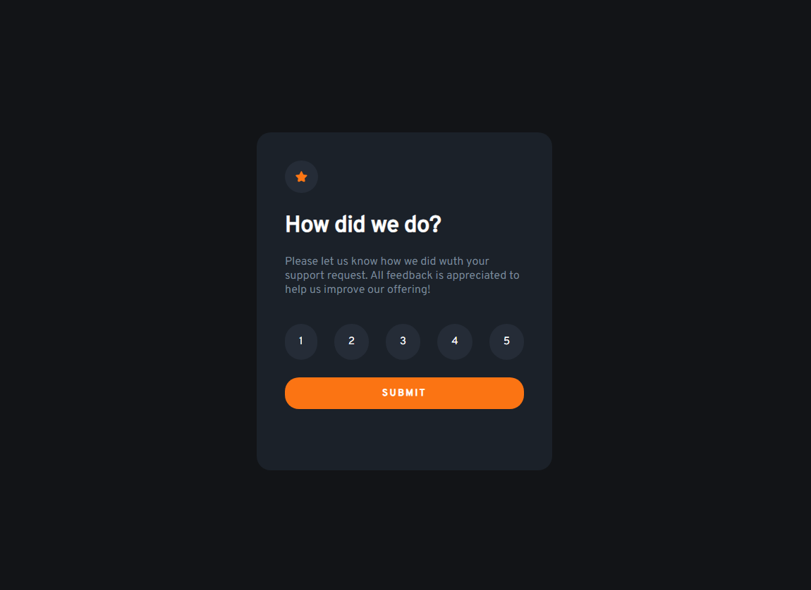

# Tela de avaliação
Uma tela de animação simples, porém responsiva e com varias animações e funcionalidades em JavaScript

[Você pode conferir como ficou o projeto aqui](https://joao121gf.github.io/Desafios-JavaScript-Mentor/)

## 🛠 Tecnologias
* HTML5
* CSS3
* JavaScript

## Autor
João Giovani - https://github.com/joao121gf

## 💬Contato
* https://github.com/joao121gf
* https://www.linkedin.com/in/jo%C3%A3o-giovani-657192204/

## Licença
Este projeto está licenciado sob a licença MIT - consulte o arquivo LICENSE.md para obter detalhes.

